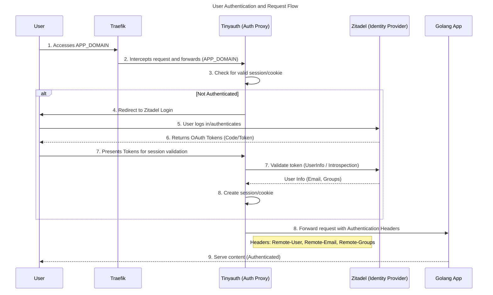

# Securing a Golang Application with Zitadel, Traefik, and Tinyauth

A complete guide to implementing forward authentication with role-based access control for a Golang application using Zitadel (Identity Provider), Tinyauth (Forward Auth Middleware), and Traefik (Reverse Proxy).

## Overview

This setup demonstrates how to secure a Golang web application using:

- **Zitadel**: Open-source identity and access management (IAM) platform that handles user authentication
- **Tinyauth**: Lightweight forward authentication middleware that integrates with reverse proxies
- **Traefik**: Modern reverse proxy that routes requests and enforces authentication
- **Golang App**: Simple application that displays authentication headers to verify the setup

**Purpose**: Local development and testing environment to showcase secure authentication patterns.

**Note**: This setup uses HTTP for local testing only. For production environments, HTTPS/TLS should be configured.

## Architecture

```
User Request → Traefik → Tinyauth (checks auth) → Zitadel (if not authenticated)
                    ↓                                      ↓
              Golang App ← Headers (user, email, groups) ← Access Token
```

### Flow:

1. User accesses `APP_DOMAIN`
2. Traefik intercepts the request and forwards it to Tinyauth
3. Tinyauth checks if the user has a valid session
4. If not authenticated, Tinyauth redirects to Zitadel login
5. User logs in with Zitadel
6. Zitadel returns OAuth tokens with user information and roles
8. Tinyauth creates a session and forwards authentication headers to the app
9. The Golang app receives headers: `Remote-User`, `Remote-Email`, `Remote-Groups`


